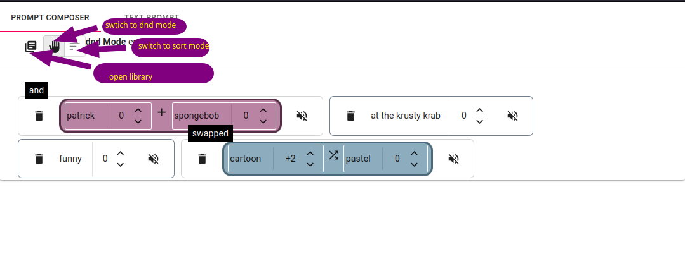

# Invoke Prompt Editor POC

This is a POC (proof-of-concept) front-end for a new prompt editor for [Invoke](https://invoke-ai.github.io/).

This will envtually be merged into the Invoke code base.

## Features and Usage

There are 2 tabs shown:

- **Prompt Composer** This is where you'll add prompt items to your composition.
- **Text Prompt** This is the original native prompt of Invoke. As you edit in the **PromptComposer**, the
text will be updated.

### Prompt Library

The prompt library is indicated by the  symbol. If you click in, a prompt library will open.

To insert a prompt into the composer, click the **plus icon** (+).

To add a new prompt to the library, use the fields at the bottom.

### Prompt Composer

The prompt composer as bare prompts (called **Nugget**s).

Each **Nugget** has a score, indicated by a number beside the prompt. The number relates to the number of times
`+` or `-` is added to the prompt

**Nugget**s can be grouped into components called **Operations**. To group **Nugget**s together, ensure you're in *dnd Mode*,
and move one nugget onto another.

If you want to add a nugget to an *operation*, drag it into the *operation*.

To change the *operator*, right click on the **Operation** and select a new one.

**Limitations:**
- Operations cannot be grouped into other **Operation**s.
- **Nugget**s must be grouped by category (e.g. "Vibes" can only be grouped with other "Vibes").

# Getting Started with Create React App

This project was bootstrapped with [Create React App](https://github.com/facebook/create-react-app),
and uses `pnpm` for the package manager.

## Available Scripts

In the project directory, you can run:

### `pnpm start`

Runs the app in the development mode.\
Open [http://localhost:3000](http://localhost:3000) to view it in the browser.

The page will reload if you make edits.\
You will also see any lint errors in the console.

### `pnpm test`

Launches the test runner in the interactive watch mode.\
See the section about [running tests](https://facebook.github.io/create-react-app/docs/running-tests) for more information.

### `pnpm run build`

Builds the app for production to the `build` folder.\
It correctly bundles React in production mode and optimizes the build for the best performance.

The build is minified and the filenames include the hashes.\
Your app is ready to be deployed!

See the section about [deployment](https://facebook.github.io/create-react-app/docs/deployment) for more information.

### `npm run eject`

**Note: this is a one-way operation. Once you `eject`, you can’t go back!**

If you aren’t satisfied with the build tool and configuration choices, you can `eject` at any time. This command will remove the single build dependency from your project.

Instead, it will copy all the configuration files and the transitive dependencies (webpack, Babel, ESLint, etc) right into your project so you have full control over them. All of the commands except `eject` will still work, but they will point to the copied scripts so you can tweak them. At this point you’re on your own.

You don’t have to ever use `eject`. The curated feature set is suitable for small and middle deployments, and you shouldn’t feel obligated to use this feature. However we understand that this tool wouldn’t be useful if you couldn’t customize it when you are ready for it.

## Learn More

You can learn more in the [Create React App documentation](https://facebook.github.io/create-react-app/docs/getting-started).

To learn React, check out the [React documentation](https://reactjs.org/).
